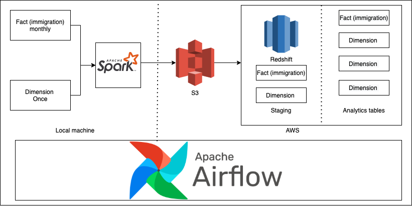
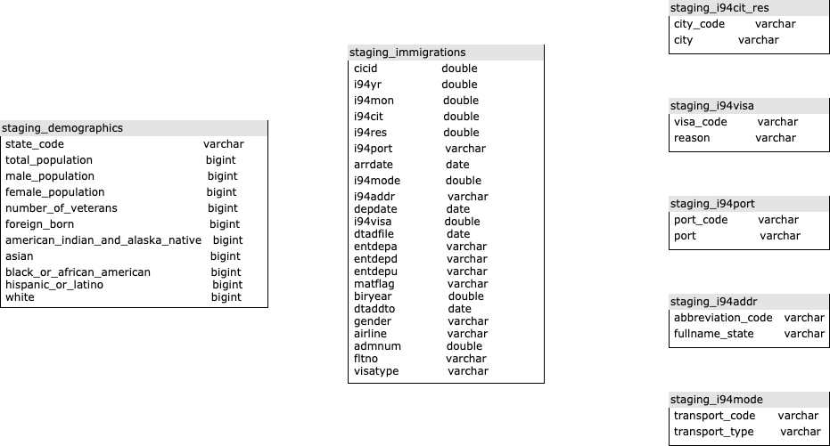
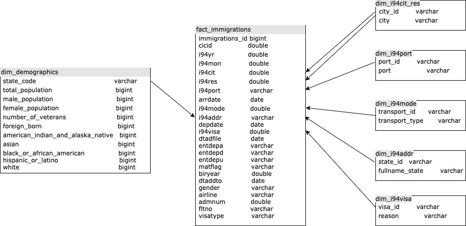

# Udacity Data Engineering Nanodegree Capstone Project
# The ​immigration to the United State
## Overview
The purpose of this project is to combine the various data source into an analytics table or back-end database. The data source consist of data on immigration to the United States, U.S. city demographics. This project is a final project. It will apply various tools that have been learned from many lessons such as data modelling, cloud data warehouses, data lakes with spark, and data pipelines with airflow.

This database is used to answer who immigrates to the US where and when.

## Quick Start
### Prerequisite
1. docker version 20.10.7
2. Docker Compose version v2.0.0-beta.6 (4 cores and 16 ram up)
3. AWS account, accessible to s3 and redshift
4. git 

### How to get started
#### START
1. Clone the repository.
```
$ git clone https://github.com/ohmohmpr/Udacity-Data-Engineering-Nanodegree-Capstone-Project.git/
```

2. Start docker.
```
$ docker-compose up -d
```
or 
```
$ docker-compose up --build -d
```

3. Monitor that everything work correctly.
```
$ docker-compose logs -f 
```

4. Open Jupyterlab. type http://127.0.0.1:8888/ in your brownser.

5. [dwh.cfg](work/dwh.cfg) put your AWS credential in [AWS] section.
6. use [IAC.ipynb](work/IAC.ipynb) to create redshift programmatically.
7. Take note of the cluster endpoint and role ARN from (From 2.2)
8. put it into [dwh.cfg](work/dwh.cfg).
9. Open Apache airflow

```
http://0.0.0.0:8080
username: airflow
password: airflow

```

10 . Add connection
```
1. 
Conn id: spark_default
Conn Type: Spark
Host: spark://spark
Port: 7077

2.
Conn Id:  redshift
Conn Type: Postgres
Host: 
Schema: dev
Login: awsuser
Password: 
Port: 5439

3. aws_credentials
Conn Id: aws_credentials.
Conn Type: Amazon Web Services.
Login: 
Password: 
```
10. You can monitor spark job here http://localhost:8081/

11. When redshift is ready. Run python(in jupyter notebook) file to create table in redshift.
```
$ python create_tables.py
```
12. Put sas7bdat file in [work/data](work/data)

13. Run jobs in airflow 
```
load_dimension_once
load_fact_monthly
```

14. When everything done. Try to query in redshift.

15. STOP
```
$ docker-compose down
```

15. Go back to [IAC.ipynb](work/IAC.ipynb) to delete redshift programmatically.

16. Maybe delete your S3.

## Data Source Analysis

### Data source
1. [I94_SAS_Labels_Descriptions.SAS](./I94_SAS_Labels_Descriptions.SAS).      
This file contains many useful data. I extracted [i94addr_df](work/data/i94addr_df.csv), [i94cit_res_df](work/data/i94cit_res_df.csv), [i94mode_df](work/data/i94mode_df.csv), [i94port_df](work/data/i94port_df.csv),[i94visa_df](work/data/i94visa_df.csv).   
For more information, Please take a look in [Analysis](work/Analysis.ipynb)

2. [data](./data)
All sas7bdat file are in this folder. You should put the sas7bdat file here. I do not include it into this repositoty due to they are large.


### Tools Selection:
1. Python: familiar language with new user and various tool for data engineer supported.
2. Pandas: To analys small dataset.
3. Spark: To deal with large dataset.
4. Airflow: For scheduling jobs, create job as pipeline.
5. Redshift: Handle 1M rows database.
6. S3: Store parquet file, low cost.
7. Star schema: 
    7.1 It is easy to understand and build as you can see I just insert data with a little modification.
    7.2 When querying data, it is easy to join an additional useful data. No need complex joins. 
    7.3 Fast aggregations. We can derive better business insights.

### How often ETL script should be run:
1. [load_fact_monthly](airflow/dags/load_fact_monthly.py) monthly because I94 data is available once per month
1. [load_dimension_once](airflow/dags/load_dimension_once.py) once because it is used for dimension which are not often updated.

### Data is 100x:
We should move spark from local to EMR because EMR can handle large dataset.

### Data is used in dashboard and updated every day 07:00AM:
Edit airflow custom operator to run daily.

### DB is accessed by 100+ people:
Redshift is already fine for this answer.

### DAG 



### DATA model
#### STAGING SCHEMA

#### STAR SCHEMA



## SAMPLE QUERY 
It is in IAC step 4 
[IAC.ipynb](IAC.ipynb)


